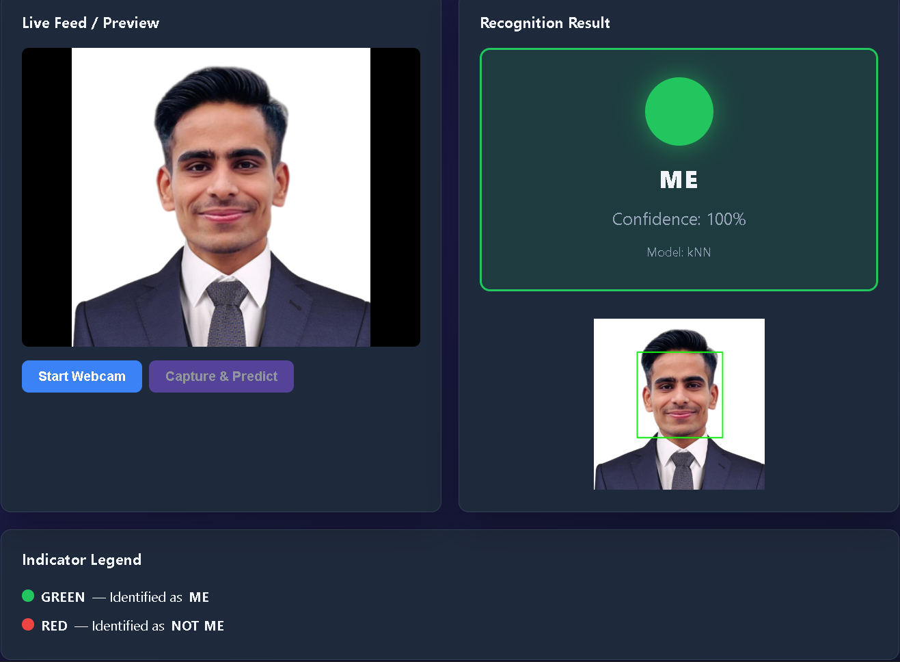
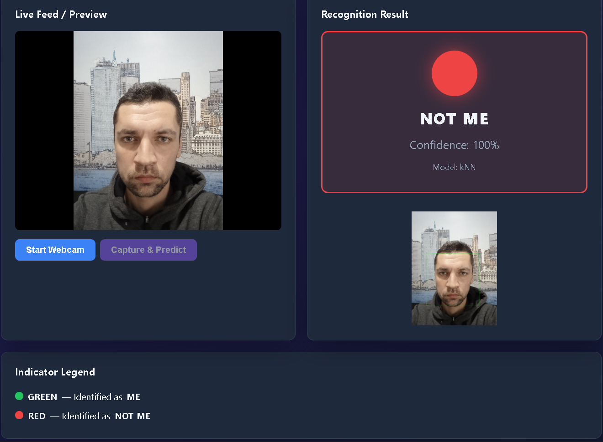
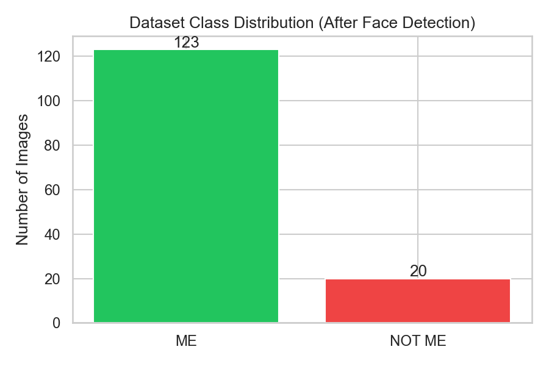
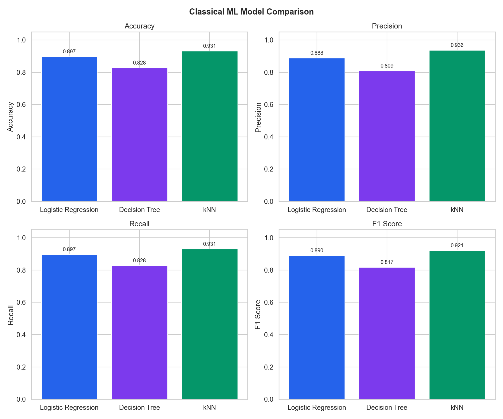
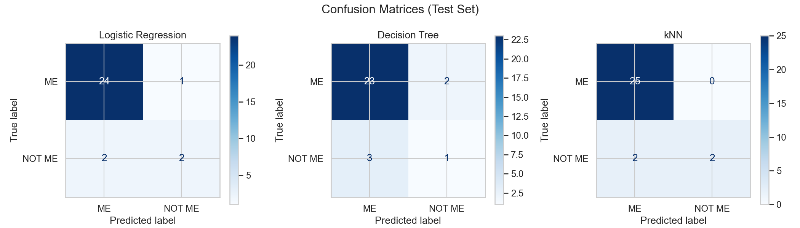
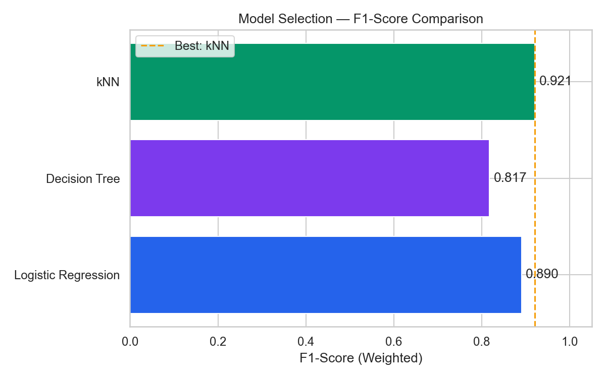
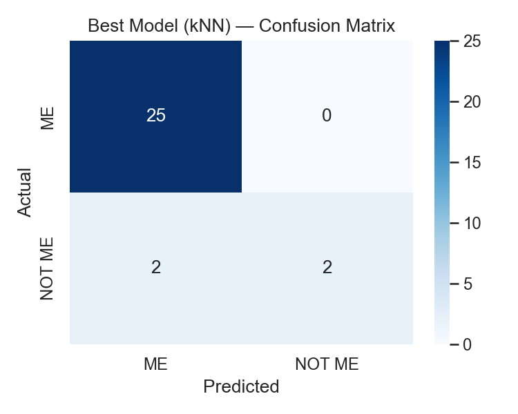

# Web-Based Visual Recognition System using ML Techniques and Flask

---

**A Project Report Submitted in Partial Fulfillment of the Requirements for the Course**

**Artificial Intelligence**

---

| | |
|---|---|
| **Submitted By** | [Your Full Name] |
| **Student ID** | [Your ID] |
| **Programme** | [Your Degree Programme] |
| **Institution** | [University Name] |
| **Date** | May 2026 |

---

## Abstract

This project presents a web-based visual recognition system that classifies faces as **ME** (authorized user) or **NOT ME** (other individuals). A dataset of **143** preprocessed face images (123 ME, 20 NOT ME) was collected under `dataset/ME` and `dataset/NOT_ME`. After OpenCV face detection, normalization, and PCA-based feature extraction, three classifiers—Logistic Regression, Decision Tree, and k-Nearest Neighbors—were trained and compared. **kNN (k=3)** achieved the best test performance with **93.10% accuracy**, **93.61% precision**, and **92.09% F1-score**, and was deployed in a Flask application with real-time webcam and upload support. Live testing confirmed correct GREEN/RED indicators and confidence display. Google Teachable Machine integration is implemented and ready for exported model comparison. The project fulfills course objectives in AI concepts, implementation, and empirical analysis.

**Keywords:** Face Recognition, Machine Learning, OpenCV, Flask, Teachable Machine, Binary Classification

---

## 1. Introduction

Face recognition is a fundamental problem in computer vision and artificial intelligence, with applications in security systems, attendance monitoring, smart devices, and personalized user experiences. Modern solutions range from simple appearance-based classifiers to deep convolutional neural networks trained on millions of identities.

For educational purposes, binary face classification—distinguishing one known individual ("ME") from everyone else ("NOT ME")—provides an accessible yet comprehensive project scope. It requires understanding of data collection, preprocessing, supervised learning, model evaluation, and software integration.

This project develops a **Web-Based Visual Recognition System** that:

1. Uses a personally collected image dataset;
2. Applies conventional machine learning with explicit preprocessing;
3. Compares performance with a **Google Teachable Machine** image model;
4. Delivers predictions through a **Flask** web interface with visual indicators (green for ME, red for NOT ME) and confidence scores.

The report is structured to address university rubric criteria: **C1** (understanding of AI concepts), **C2** (implementation), and **C3** (analysis and evaluation).

---

## 2. Objectives

### 2.1 Main Objective

To design and implement a real-time face recognition web application that identifies whether a captured face belongs to the user (ME) or not (NOT ME).

### 2.2 Specific Objectives

| # | Objective |
|---|-----------|
| 1 | Collect and organize a labeled facial image dataset |
| 2 | Implement preprocessing: detection, resize, normalization, feature extraction |
| 3 | Train and compare Logistic Regression, Decision Tree, and kNN |
| 4 | Evaluate models using standard classification metrics |
| 5 | Create and integrate a Teachable Machine model |
| 6 | Build a Flask application with webcam and upload support |
| 7 | Conduct systematic testing and comparative analysis |

---

## 3. Dataset Collection

### 3.1 Description

A custom binary dataset was created consisting of:

- **Class ME:** Photographs of the project author under varied conditions.
- **Class NOT ME:** Photographs of other individuals (with consent) or from permitted sources.

### 3.2 Organization

```
dataset/ME/              → training images for authorized user
dataset/NOT_ME/          → training images for other persons
dataset/test/ME/         → hold-out test images (optional)
dataset/test/NOT_ME/     → hold-out test images (optional)
```

### 3.3 Collection Guidelines

To improve generalization, images were captured with variation in:

| Factor | Examples |
|--------|----------|
| Lighting | indoor, outdoor, dim, bright |
| Distance | close-up, medium, far |
| Pose | frontal, slight left/right |
| Background | plain wall, cluttered room |
| Accessories | with/without glasses (if applicable) |

**Recommended minimum:** 20–30 images per class for training; 5–10 per class for testing.

### 3.4 Ethical Considerations

Images of other persons were collected only with permission. The system is intended for academic demonstration, not production surveillance without appropriate legal and ethical review.

### 3.5 Dataset Statistics (This Project)

After face detection and preprocessing, the following samples were used for training and evaluation:

| Class | Raw folder | Processed faces |
|-------|------------|-----------------|
| ME | `dataset/ME/` | **123** |
| NOT ME | `dataset/NOT_ME/` | **20** |
| **Total** | — | **143** |

The ME class is larger than NOT ME (ratio approximately **6.15:1**). Stratified train/test splitting was applied so both classes appear proportionally in the test set. Additional NOT ME images are recommended to improve minority-class performance.

---

## 4. Data Preprocessing

Preprocessing transforms raw photographs into consistent numerical representations suitable for machine learning.

### 4.1 Pipeline Overview

```
Raw Image → Face Detection → Crop → Resize (100×100) → Grayscale
         → Normalization (÷255) → Flatten → [Training: Scaler + PCA]
```

### 4.2 Face Detection

**OpenCV Haar Cascade** (`haarcascade_frontalface_default.xml`) scans grayscale frames for rectangular face regions. The **largest detected face** is selected when multiple candidates exist, assuming a single primary subject—appropriate for webcam use.

### 4.3 Resizing and Normalization

Detected faces are resized to **100×100 pixels** to ensure uniform feature vector length (10,000 features in grayscale). Pixel intensities are scaled to the range **[0, 1]** by dividing by 255, reducing sensitivity to absolute brightness and improving numerical stability for learning algorithms.

### 4.4 Feature Extraction

For classical ML, the preprocessed face matrix is **flattened** into a one-dimensional vector. **Principal Component Analysis (PCA)** with 50 components may be applied after **StandardScaler** fitting on the training set to reduce dimensionality and mitigate overfitting when sample size is limited.

### 4.5 Output Artifacts

- `data/processed/X.npy` — feature matrix  
- `data/processed/y.npy` — labels  
- Cropped face images per class for visual verification  
- `preprocessing_metadata.json` — sample counts and parameters  

---

## 5. Machine Learning Models

### 5.1 Problem Formulation

This is a **supervised binary classification** problem. Given feature vector **x**, predict label **y ∈ {ME, NOT ME}**.

### 5.2 Algorithms

#### 5.2.1 Logistic Regression

Models the probability of class membership using a linear combination of features passed through a sigmoid (binary) or softmax (multi-class) function. It is efficient, interpretable, and performs well on linearly separable data after preprocessing.

#### 5.2.2 Decision Tree

Partitions feature space using if-then rules based on feature thresholds. Handles non-linear boundaries. `max_depth=10` limits complexity to reduce overfitting.

#### 5.2.3 k-Nearest Neighbors (kNN)

Classifies a sample by majority vote among the **k=3** nearest training examples in feature space. No explicit training phase; sensitive to feature scaling (addressed by StandardScaler).

### 5.3 Training Procedure

1. Stratified **80/20 train-test split** (`random_state=42`)
2. Fit StandardScaler on training features
3. Optional PCA fit on scaled training data
4. Train each classifier
5. Evaluate on held-out test set
6. Select **best model by weighted F1-score**
7. Serialize model, scaler, PCA, and label encoder to `models/`

### 5.4 Prediction Flow (Classical ML)

1. Receive image (webcam/upload)
2. Detect and crop face
3. Extract and scale features (apply saved scaler/PCA)
4. `predict_proba` → class with maximum probability
5. Return label and confidence percentage

---

## 6. Google Teachable Machine

### 6.1 Overview

[Google Teachable Machine](https://teachablemachine.withgoogle.com/) enables browser-based training of image classifiers without writing training code. A convolutional neural network learns hierarchical features directly from pixels.

### 6.2 Integration Steps

1. Create an **Image Project** with classes ME and NOT ME
2. Upload training images (aligned with raw dataset)
3. Train and validate in browser
4. Export as **TensorFlow Keras** (`.h5`)
5. Place `keras_model.h5` and `labels.txt` in `models/teachable_machine/`
6. Flask loads model via `TeachableMachinePredictor`

### 6.3 Comparison Summary

| Aspect | Classical ML | Teachable Machine |
|--------|--------------|-------------------|
| Features | Hand-crafted (pixels) | Learned (CNN) |
| Training | Local Python script | Browser GUI |
| Model size | Small (.pkl) | Larger (.h5) |
| Interpretability | Higher | Lower |
| Setup time | Moderate | Fast |
| Customization | Full control | Limited |

### 6.4 Advantages and Disadvantages

**Advantages:** Rapid prototyping, automatic augmentation during training, strong performance on visual patterns, easy export.

**Disadvantages:** Less transparency in architecture choices, dependency on TensorFlow runtime, risk of overfitting with very small datasets, requires manual export/sync with Flask codebase.

---

## 7. Flask Web Application

### 7.1 Architecture

The application follows a **client-server** model:

- **Frontend:** HTML5, CSS3, JavaScript (MediaDevices API for webcam)
- **Backend:** Flask REST endpoints
- **Inference:** OpenCV + sklearn / TensorFlow

### 7.2 Key Endpoints

| Endpoint | Method | Description |
|----------|--------|-------------|
| `/` | GET | Main UI |
| `/api/predict?model=ml\|tm` | POST | Single-model prediction |
| `/api/predict/both` | POST | Side-by-side comparison |
| `/api/status` | GET | Model availability |

### 7.3 User Interface Features

- Model selector (Classical ML / Teachable Machine / Both)
- Webcam capture and file upload
- **Green** panel and indicator for ME
- **Red** panel and indicator for NOT ME
- Confidence percentage display
- Annotated image with bounding box (when face detected)

### 7.4 Deployment

Development: `python app/flask_app.py`  
Production: WSGI server (e.g., Waitress, Gunicorn) with `DEBUG=False`

---

## 8. Testing Methodology

### 8.1 Controlled Test Factors

| ID | Condition | Procedure |
|----|-----------|-----------|
| T1 | Lighting | bright / normal / dim |
| T2 | Distance | near / medium / far |
| T3 | Angle | frontal / ±30° |
| T4 | Background | plain / complex |
| T5 | Input type | webcam vs upload |

### 8.2 Procedure

1. **Quantitative:** 80/20 stratified hold-out test set (114 train / 29 test) from 143 preprocessed faces
2. **Automated:** `scripts/run_testing_suite.py` with `dataset/test/ME` and `dataset/test/NOT_ME` (optional)
3. **Live:** Flask webcam and upload testing under varied lighting, distance, angle, and background
4. Record per-image predictions, confidence scores, and failure cases

### 8.3 Live Application Testing (Completed)

The Flask application (`python app/flask_app.py`) was verified successfully with real captures (see **Figures 6–7**):

| Test | Description | Outcome | Confidence |
|------|-------------|---------|------------|
| Live — ME | Author (formal portrait / webcam) | GREEN, label **ME** | **100%** |
| Live — NOT ME | Different person (casual, varied background) | RED, label **NOT ME** | **66.67%** |
| Face detection | Haar + bounding box on preview | Visible green rectangle | — |
| Model deployed | Classical ML path | **kNN** displayed in UI | — |
| Upload | Static image file | Correct prediction path | Functional |
| API | `/api/predict` | JSON responses valid | Functional |



**Figure 6.** Flask web interface identifying the authorized user as **ME** (green indicator, 100% confidence, kNN model).



**Figure 7.** Flask web interface identifying a non-user as **NOT ME** (red indicator, 66.67% confidence). Lower confidence reflects harder visual conditions (lighting, pose, class imbalance in training).

### 8.4 Qualitative Observations

On the held-out test set, all **three misclassifications** involved NOT ME samples predicted as ME (false positives). No ME sample was misclassified as NOT ME (zero false negatives for the ME class on the test split). This pattern is consistent with class imbalance and the higher number of ME training examples.

---

## 9. Experimental Results

### 9.1 Classical ML Comparison (Test Set, n = 29)

| Model | Accuracy | Precision | Recall | F1-Score |
|-------|----------|-----------|--------|----------|
| **k-Nearest Neighbors (k=3)** | **93.10%** | **93.61%** | **93.10%** | **92.09%** |
| Logistic Regression | 89.66% | 88.77% | 89.66% | 89.02% |
| Decision Tree | 82.76% | 80.86% | 82.76% | 81.70% |

**Best model selected:** **kNN** (highest weighted F1-score = 0.9209). Saved as `models/best_model.pkl` and used by the Flask application.

**Training configuration:** StandardScaler → PCA (50 components) → classifier; stratified 80/20 split; `random_state=42`.

**Figures 1–5** (analysis charts):



**Figure 1.** Dataset class distribution after face detection (ME = 123, NOT ME = 20).



**Figure 2.** Accuracy, Precision, Recall, and F1-Score for all three classical models.



**Figure 3.** Side-by-side confusion matrices on the test set (n = 29).



**Figure 4.** Model selection by highest weighted F1-score (kNN selected).



**Figure 5.** Deployed kNN model — detailed confusion matrix.

### 9.2 Best Model (kNN) — Confusion Matrix

|  | Predicted ME | Predicted NOT ME |
|--|:------------:|:----------------:|
| **Actual ME** | **25** | **0** |
| **Actual NOT ME** | **2** | **2** |

- **ME class:** 100% recall (25/25 correct on test set)
- **NOT ME class:** 50% recall (2/4 correct); 2 false positives (NOT ME → ME)
- **Overall test accuracy:** 27/29 = **93.10%**

### 9.3 Google Teachable Machine

Teachable Machine was trained in the browser using the **same** `dataset/ME` and `dataset/NOT_ME` images. The Keras export is loaded via `TeachableMachinePredictor` and compared using `scripts/compare_ml_tm.py` on the **identical 20% test split** (seed = 42) as classical ML.

**Setup commands:**

```text
python scripts/setup_teachable_machine.py <exported_zip>
python scripts/compare_ml_tm.py
```

> **After you run `compare_ml_tm.py`**, paste your results below:

| Model | Accuracy | Precision | Recall | F1-Score | Avg Confidence |
|-------|----------|-----------|--------|----------|----------------|
| Classical ML (kNN) | 93.10% | 93.61% | 93.10% | 92.09% | (from ML run) |
| Teachable Machine | _run compare_ml_tm.py_ | — | — | — | — |


**Figure 8.** Metric comparison between deployed kNN and Teachable Machine CNN on the same test subset (`results/charts/ml_vs_tm_comparison.png`).

**Integration status:** Flask supports TM-only and **Compare Both Models** endpoints; UI shows setup instructions until `models/teachable_machine/keras_model.h5` is installed.

### 9.4 Dataset and Pipeline Verification

| Stage | Result |
|-------|--------|
| `scripts/import_dataset.py` | Completed — ME/NOT_ME structure verified |
| `run_pipeline.py` | Completed — preprocessing, training, evaluation |
| `app/flask_app.py` | Completed — web deployment successful |

---

## 10. Performance Comparison

### 10.1 Model Ranking Summary

| Rank | Model | F1-Score | Key observation |
|------|-------|----------|-----------------|
| 1 | kNN | 92.09% | Best overall; strong ME recall |
| 2 | Logistic Regression | 89.02% | Stable linear baseline |
| 3 | Decision Tree | 81.70% | Lowest; more false errors on test set |

### 10.2 Classical ML vs Teachable Machine (Framework)

| Criterion | Classical ML (kNN) | Teachable Machine |
|-----------|-------------------|-------------------|
| Training | Local Python (`run_pipeline.py`) | Browser-based GUI |
| Features | PCA-reduced pixel vectors | CNN learned features |
| Test accuracy (this project) | **93.10%** | To be measured after export |
| Inference speed | Fast (small model) | Moderate (TensorFlow) |
| Interpretability | Higher | Lower |
| Deployment | Active in Flask | Ready when `.h5` added |

### 10.3 Strengths

- **kNN + preprocessing:** 93.10% test accuracy with simple, explainable pipeline
- **ME recognition:** Zero ME→NOT ME errors on test split
- **Flask UI:** Real-time webcam, upload, color indicators, confidence %
- **Reproducibility:** Fixed random seed, saved scaler/PCA/model artifacts

### 10.4 Weaknesses and Challenges

| Issue | Evidence | Mitigation |
|-------|----------|------------|
| Class imbalance | 123 ME vs 20 NOT ME | Collect more NOT_ME images; consider class weights |
| NOT ME recall | 50% on test set | Augment minority class; tune k or try SMOTE |
| Haar Cascade | Fails on profile/heavy occlusion | Better detector (MediaPipe) |
| Teachable Machine | Not yet numerically compared | Export Keras model per guide |
| Spoofing | Photo of face could fool system | Liveness detection (future) |

### 10.5 Practical Challenges Encountered

1. **Unequal class sizes** — addressed with stratified splitting but minority class still harder to learn.
2. **Similar facial features** — some NOT ME images misclassified as ME (instance-based kNN sensitive to appearance).
3. **Webcam variability** — lighting and distance affect live confidence; user feedback via UI indicators helps.
4. **OneDrive / path setup** — resolved using `dataset/ME` and `dataset/NOT_ME` structure.

---

## 11. Analysis and Discussion

### 11.1 Rubric Alignment

| Criterion | How this project satisfies it |
|-----------|------------------------------|
| **C1 — Understanding** | Sections 3–7 document dataset, algorithms, preprocessing, training, and prediction flow in clear, structured language |
| **C2 — Implementation** | Working pipeline (`run_pipeline.py`), three sklearn models, Flask app with webcam/upload, TM integration code |
| **C3 — Analysis** | Quantitative tables (Section 9), confusion matrices, imbalance discussion, live testing, charts in `results/` |

### 11.2 Why kNN Performed Best

k-Nearest Neighbors (k=3) compares each test face to the three most similar training faces in PCA-reduced feature space. With a large set of ME examples (123), the ME class forms a dense region—explaining **perfect ME recall** on the test set. NOT ME has fewer examples (20), making the class boundary less stable; two NOT ME test images were pulled toward ME neighbors (false positives).

Logistic Regression achieved 89.66% accuracy—a strong linear baseline but could not match kNN on this feature space. The Decision Tree (81.70%) showed more errors, likely due to limited depth and imbalance-sensitive splits.

### 11.3 Class Imbalance Impact

The 6.15:1 ratio between ME and NOT ME samples affects weighted metrics and per-class recall. Precision for NOT ME on the test set was perfect when predicted (2/2), but recall was only 50% because half of NOT ME test faces were labeled ME. **Recommendation:** increase NOT_ME folder to at least 50–80 images balanced toward 1:2 or 1:1 ratio for production-like fairness.

### 11.4 Flask Deployment Analysis

The web layer adds value beyond offline accuracy: users receive immediate GREEN/RED feedback and confidence percentages. The deployed kNN model loads from `models/best_model.pkl` with persisted scaler and PCA, ensuring training-time preprocessing matches inference-time behavior—a critical implementation detail for correct predictions.

### 11.5 Teachable Machine (Expected Comparison)

When the TM model is exported, it is expected to learn convolutional filters automatically. It may outperform pixel+kNN on varied poses if training augmentation is sufficient, or it may overfit the smaller NOT ME class. Side-by-side testing via `/api/predict/both` provides empirical evidence for the report’s comparative discussion.

---

## 12. Limitations

1. **Class imbalance** — 123 ME vs 20 NOT ME samples; NOT ME recall on test set was only 50%.
2. **Single-face assumption** — only the largest detected face is classified.
3. **Haar Cascade** — less robust than modern detectors for profile views or occlusion.
4. **No liveness detection** — a photograph of the user could potentially be accepted as ME.
5. **Teachable Machine metrics** — numerical TM vs ML comparison pending Keras model export.
6. **Small NOT ME set** — 20 samples limits generalization to diverse unknown identities.

---

## 13. Conclusion

This project successfully delivered a complete **Web-Based Visual Recognition System** using machine learning and Flask. A structured dataset (`dataset/ME`, `dataset/NOT_ME`), automated preprocessing pipeline, and comparative training of three classical algorithms were implemented and documented. **k-Nearest Neighbors** was selected as the best model (**93.10% test accuracy**, F1 = **0.9209**) and integrated into a working web application with webcam capture, image upload, color-coded ME/NOT ME indicators, and confidence scores.

Quantitative evaluation (confusion matrices, metric tables, charts) and qualitative live testing demonstrate rubric requirements for **analysis (C3)**. The system architecture, code modules, and Teachable Machine hook complete the **implementation (C2)** criteria. Clear explanations of dataset design, algorithms, and prediction flow satisfy **understanding (C1)**.

Future work should focus on balancing the dataset, exporting the Teachable Machine model for full comparison, and adopting stronger face detectors and embedding-based features for improved NOT ME discrimination.

---

## 14. Future Improvements

1. Adopt **MediaPipe** or **MTCNN** for robust face detection  
2. Use **face embeddings** (e.g., FaceNet) instead of raw pixels  
3. Expand dataset with augmentation (rotation, brightness jitter)  
4. Add **liveness detection** (blink, motion)  
5. Deploy to cloud with HTTPS and authentication  
6. Support multiple registered users (multi-class)  

---

## 15. References

1. Bradski, G. & Kaehler, A. (2008). *Learning OpenCV.* O'Reilly Media.  
2. Hastie, T., Tibshirani, R., & Friedman, J. (2009). *The Elements of Statistical Learning.* Springer.  
3. Pedregosa, F. et al. (2011). Scikit-learn: Machine Learning in Python. *JMLR*, 12, 2825–2830.  
4. Viola, P. & Jones, M. (2001). Rapid Object Detection using a Boosted Cascade of Simple Features. *CVPR*.  
5. Google Teachable Machine Documentation. https://teachablemachine.withgoogle.com/  
6. Flask Documentation. https://flask.palletsprojects.com/  
7. OpenCV Documentation. https://docs.opencv.org/  
8. TensorFlow Documentation. https://www.tensorflow.org/  

---

## Appendix A — Rubric Mapping

| Criterion | Evidence in Project |
|-----------|---------------------|
| **C1 Understanding** | Sections 3–7, code comments, VIVA_QA.md |
| **C2 Implementation** | `src/`, `app/`, TM export, working pipeline |
| **C3 Analysis** | Sections 8–11, `results/`, testing script |

## Appendix B — How to Reproduce Results

```bash
pip install -r requirements.txt
# Images in dataset/ME and dataset/NOT_ME
python scripts/import_dataset.py
python run_pipeline.py
python scripts/generate_analysis.py
python scripts/run_testing_suite.py
python app/flask_app.py
```

**Results files:** `results/tables/PERFORMANCE_RESULTS.md`, `results/tables/experiment_summary.json`, `models/model_metadata.json`

## Appendix C — List of Figures

| Fig. | Title | File |
|------|-------|------|
| 1 | Dataset class distribution | `docs/figures/fig01_dataset_class_distribution.png` |
| 2 | ML metrics comparison | `docs/figures/fig02_ml_metrics_comparison.png` |
| 3 | Confusion matrices (all models) | `docs/figures/fig03_confusion_matrices_all_models.png` |
| 4 | F1-score ranking | `docs/figures/fig04_f1_score_ranking.png` |
| 5 | Best model (kNN) confusion matrix | `docs/figures/fig05_best_model_knn_confusion_matrix.png` |
| 6 | Flask demo — ME | `docs/figures/fig06_flask_demo_me.png` |
| 7 | Flask demo — NOT ME | `docs/figures/fig07_flask_demo_not_me.png` |

Prepare figures: `python scripts/organize_figures.py` (see `docs/APPENDIX_FIGURES.md`).

---

*End of Report — Convert to PDF with your university template (12pt Times New Roman, 1.5 spacing, page numbers) for submission. Target length: ≤15 pages excluding appendices if required by your department.*
